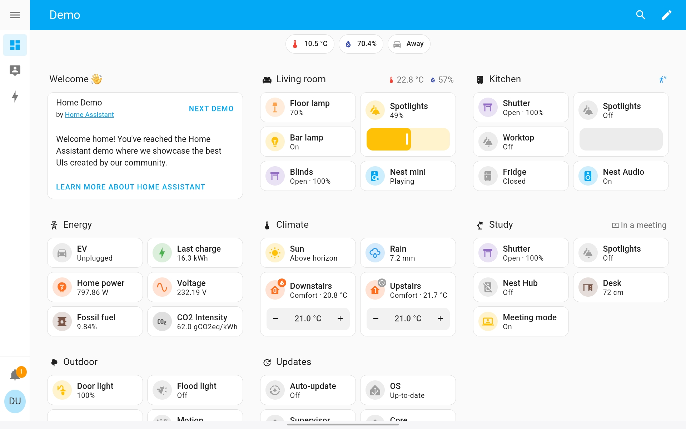
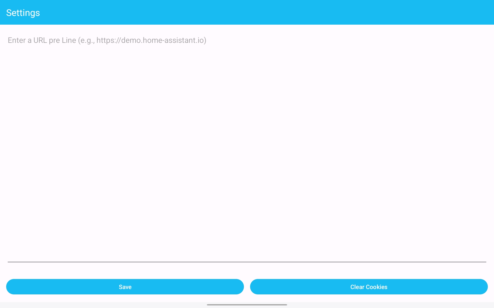

<|channel|>final<|message|># HomeAssistantLauncher

**HomeAssistantLauncher** turns your Android tablet into a smart‑home control centre.  
A single‑page launcher lets you view Home Assistant directly in a WebView while still keeping the rest of your device’s apps accessible.

---

## Key Features

| Feature | Description |
|---------|-------------|
| **WebView integration** | Loads the Home Assistant control panel inside the launcher. |
| **Multiple pages** | Add any number of web URLs (e.g. dashboards, pages). |
| **Four‑finger navigation** | Swipe with four fingers left‑to‑right (or right‑to‑left) to jump between pages. |
| **App drawer** | The very first page is the launcher’s own “home”, the very last page is an app drawer for all installed apps. |
| **Settings** | Configure the list of URLs directly from the launcher’s settings screen. |
| **Swipe‑to‑refresh** | Pull‑down refresh is available on pages. |

---

## Usage

1. **Navigate pages** – Use four fingers to swipe left‑to‑right to switch between pages.  
2. **Configure URLs** – Open the Settings screen and add or edit the web pages you’d like to see.  
3. **Access apps** – Swipe to the very last page to open the app drawer.

---

## Known Issue

- **WebView + SwipeRefreshLayout conflict** – The pull‑to‑refresh gesture may not work on a scrollable WebView.

---

## Screenshots

  
*Home Assistant Control Panel*

  
*Settings Page*

---
