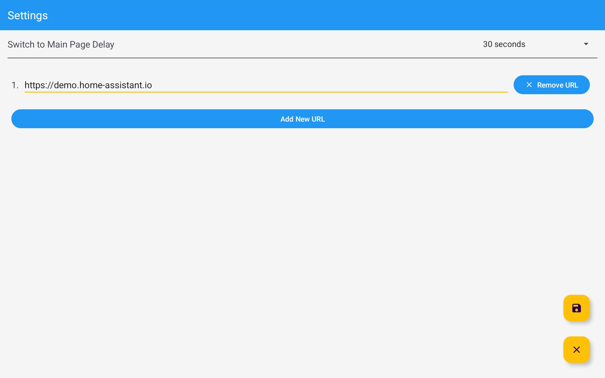

# HomeAssistantLauncher

HomeAssistantLauncher is an Android launcher app designed specifically for use on Android tablets. It provides a convenient way to access your Home Assistant control panel through a webview interface, allowing for easy management of your smart home devices.

## Features

- **Webview Integration**: Displays your Home Assistant control panel directly within the app.
- **Multi-Webpage Support**: Navigate between multiple webpages with ease.
- **Gesture Navigation**: Use a four-finger swipe from left to right to switch between webpages.
- **Settings Configuration**: Easily configure the webpages you want to access in the settings menu.
- **App Access**: Slide to the left to open other installed apps.

## Screenshots

*Home Assistant Control Panel*

*Settings Configuration*

## Usage

1. **Navigating Webpages**: To switch between webpages, use a four-finger swipe from left to right.
2. **Configuring Webpages**: Go to the settings menu to add or modify the webpages you want to access.
3. **Accessing Other Apps**: Slide to the last page on the right to open other applications installed on your device.

## Known Issues

- **WebView and SwipeRefreshLayout Conflict**: There is an inherent conflict in touch event handling when a scrollable `WebView` is placed inside a `SwipeRefreshLayout`. This can make the swipe-to-refresh gesture difficult or impossible to trigger reliably when the user's swipe starts on the `WebView`. This is a common challenge in Android development with this component combination and a robust solution is not currently implemented.
